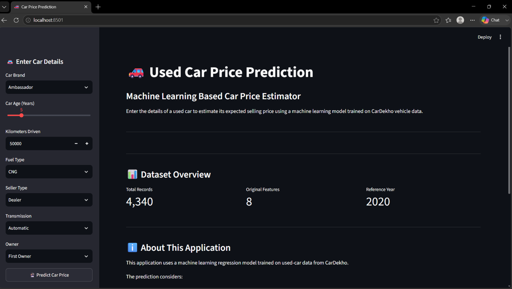
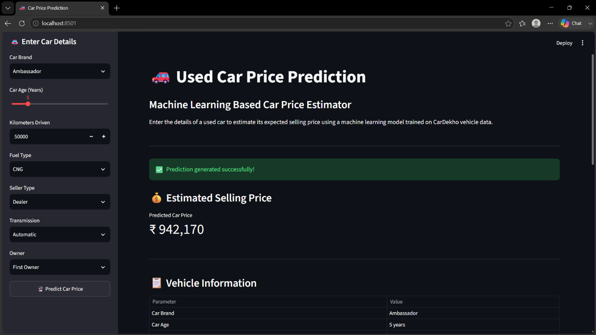
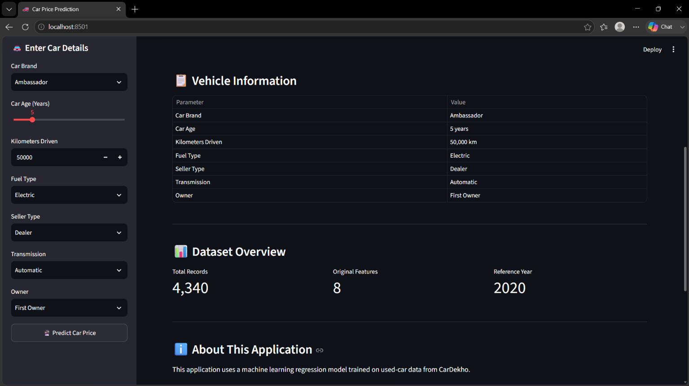

# 🚗 Car Price Prediction Using Machine Learning

## 📌 Project Overview

This project was developed as part of the **OASIS INFOBYTE Data Science
Internship --- Task 3: Car Price Prediction with Machine Learning**.

The objective is to develop a machine learning regression system that
predicts the selling price of used cars based on important vehicle
characteristics.

The project uses a **CarDekho used-vehicle dataset** containing
information such as car name, manufacturing year, selling price,
kilometers driven, fuel type, seller type, transmission, and ownership
history.

The complete workflow includes data loading and inspection, data
cleaning, duplicate removal, feature engineering, exploratory data
analysis, categorical encoding, train-test splitting, multiple
regression models, model evaluation, model comparison,
actual-vs-predicted analysis, residual analysis, feature importance,
model serialization, and an interactive Streamlit dashboard.

------------------------------------------------------------------------

## 🚀 Live Demo

[](https://oibsip-bxdvcwbsed4kvqxvtufl8u.streamlit.app/)

Try the interactive car price prediction dashboard online.
---

# 🎯 Objectives

1.  Understand the structure of the used-car dataset.
2.  Identify and handle duplicate and inconsistent records.
3.  Create meaningful features from existing data.
4.  Perform exploratory data analysis.
5.  Study factors affecting used-car selling prices.
6.  Encode categorical variables for machine learning.
7.  Train multiple regression algorithms.
8.  Evaluate models using MAE, RMSE, and R².
9.  Select the best-performing regression model.
10. Analyze feature importance.
11. Save the trained model for deployment.
12. Build an interactive Streamlit application for price prediction.

------------------------------------------------------------------------

# 📊 Dataset

## Dataset Source

The project uses the **Vehicle Dataset from CarDekho**, containing
used-car listings.

## Dataset Characteristics

  Characteristic      Details
  ------------------- -----------------
  Dataset Type        Used-car data
  Number of Records   4,340
  Original Features   8
  Target Variable     `selling_price`
  Data Type           Tabular
  Problem Type        Regression
  Reference Year      2020

## Original Features

  Feature           Description
  ----------------- --------------------------
  `name`            Name of the car
  `year`            Manufacturing year
  `selling_price`   Selling price of the car
  `km_driven`       Kilometers driven
  `fuel`            Fuel type
  `seller_type`     Type of seller
  `transmission`    Transmission type
  `owner`           Ownership history

------------------------------------------------------------------------

# 🧹 Data Cleaning

Before model development, the dataset was inspected for missing values,
duplicate records, data types, categorical values, and statistical
characteristics.

Duplicate records were removed to prevent repeated observations from
influencing model training.

Categorical variables were also inspected to understand their unique
values and ensure that they could be processed correctly.

------------------------------------------------------------------------

# ⚙️ Feature Engineering

## Car Age

Vehicle age was calculated using the latest year available in the
dataset as the reference year.

``` text
Car Age = Reference Year - Manufacturing Year
```

For this dataset, the reference year is **2020**.

## Car Brand

The first word from the car `name` was extracted as the brand.

Examples:

``` text
Maruti Swift Dzire VDI → Maruti
Hyundai i20 Sportz → Hyundai
Honda City V MT → Honda
```

The original `name` and `year` columns were then removed from the
modeling dataset because their useful information had been transformed
into `brand` and `car_age`.

------------------------------------------------------------------------

# 🔎 Exploratory Data Analysis

The notebook includes several visualizations.

## 1. Selling Price Distribution

A histogram with KDE was used to understand the distribution and spread
of used-car selling prices.

## 2. Selling Price by Fuel Type

Box plots compare selling prices across fuel categories.

## 3. Selling Price vs Car Age

A scatter plot investigates how vehicle age relates to selling price and
helps visualize depreciation patterns.

## 4. Selling Price vs Kilometers Driven

A scatter plot investigates the relationship between usage and resale
price.

## 5. Average Selling Price by Transmission

Average selling prices are compared across transmission categories.

## 6. Top Car Brands

The most frequently listed car brands are visualized.

## 7. Correlation Heatmap

A correlation heatmap examines relationships among numerical variables
including selling price, kilometers driven, and car age.

------------------------------------------------------------------------

# 🧠 Machine Learning Methodology

``` text
Raw Dataset
     ↓
Data Inspection
     ↓
Data Cleaning
     ↓
Feature Engineering
     ↓
Exploratory Data Analysis
     ↓
Feature / Target Separation
     ↓
Train-Test Split
     ↓
Categorical Encoding
     ↓
Model Training
     ↓
Model Evaluation
     ↓
Model Comparison
     ↓
Best Model Selection
     ↓
Model Saving
     ↓
Streamlit Deployment
```

------------------------------------------------------------------------

# ✂️ Train-Test Split

The data was divided into:

``` text
80% → Training Data
20% → Testing Data
```

A `random_state` of `42` was used for reproducibility.

------------------------------------------------------------------------

# 🔤 Categorical Feature Encoding

The following categorical variables were encoded using **One-Hot
Encoding**:

-   `fuel`
-   `seller_type`
-   `transmission`
-   `owner`
-   `brand`

The pipeline uses:

``` python
OneHotEncoder(handle_unknown="ignore")
```

This also allows the deployed application to handle previously unseen
categories more safely.

------------------------------------------------------------------------

# 🤖 Machine Learning Models

## 1. Linear Regression

Linear Regression was used as the baseline regression model.

## 2. Random Forest Regressor

Random Forest combines multiple decision trees and can capture
non-linear relationships in tabular data.

## 3. Gradient Boosting Regressor

Gradient Boosting builds models sequentially to improve prediction
performance and can capture complex non-linear patterns.

------------------------------------------------------------------------

# 📏 Model Evaluation

The models were evaluated using three regression metrics.

### MAE --- Mean Absolute Error

Measures the average absolute difference between actual and predicted
prices. Lower is better.

### RMSE --- Root Mean Squared Error

Penalizes larger prediction errors more strongly. Lower is better.

### R² --- R-Squared

Measures the proportion of target variation explained by the model.
Values closer to 1 generally indicate stronger performance.

------------------------------------------------------------------------

# 📊 Model Comparison

The notebook generates the exact evaluation results.

  -----------------------------------------------------------------------
  Model                         MAE               RMSE                 R²
  -------------- ------------------ ------------------ ------------------
  Linear               Generated in       Generated in       Generated in
  Regression               notebook           notebook           notebook

  Random Forest        Generated in       Generated in       Generated in
  Regressor                notebook           notebook           notebook

  Gradient             Generated in       Generated in       Generated in
  Boosting                 notebook           notebook           notebook
  Regressor                                            
  -----------------------------------------------------------------------

The models are compared primarily using R² while MAE and RMSE are used
to understand prediction error.

**The exact numerical results should be taken from the executed notebook
rather than manually entered into this README.**

------------------------------------------------------------------------

# 📈 Actual vs Predicted Prices

An actual-versus-predicted scatter plot was created using the
best-performing model.

The diagonal reference line represents perfect predictions. Points
closer to this line indicate smaller prediction errors.

------------------------------------------------------------------------

# 📉 Residual Analysis

Residuals represent the difference between actual and predicted values.

``` text
Residual = Actual Price - Predicted Price
```

The residual plot helps identify systematic errors, large deviations,
and possible patterns in model errors.

------------------------------------------------------------------------

# ⭐ Feature Importance

Feature importance was analyzed for the best-performing tree-based
model.

The analysis considers:

-   Car brand
-   Car age
-   Kilometers driven
-   Fuel type
-   Seller type
-   Transmission
-   Ownership history

The notebook generates a feature-importance visualization.

------------------------------------------------------------------------

# 💾 Model Serialization

The complete trained preprocessing and prediction pipeline was saved
using `joblib`.

``` text
model/car_price_model.pkl
```

Saving the complete pipeline allows the Streamlit application to use the
same preprocessing and model logic without retraining.

------------------------------------------------------------------------

# 🌐 Streamlit Dashboard

An interactive **Streamlit web application** was created for real-time
price prediction.

Users can enter:

-   Car brand
-   Car age
-   Kilometers driven
-   Fuel type
-   Seller type
-   Transmission
-   Ownership history

The application then generates an estimated selling price in Indian
Rupees.

## Dashboard Features

### 🚗 Car Details Input

Interactive controls allow users to select vehicle characteristics.

### 🔮 Price Prediction

The saved machine learning pipeline predicts the estimated selling
price.

### 💰 Price Display

The prediction is prominently displayed in Indian Rupees.

### 📋 Vehicle Information

The entered vehicle details are displayed in a structured table.

### 📊 Dataset Overview

The dashboard displays the number of records, original feature count,
and reference year.

------------------------------------------------------------------------

# 📸 Screenshots

## Dashboard Home



The dashboard provides an interactive interface for entering vehicle
information.

## Price Prediction



The application successfully generates an estimated selling price from
the selected vehicle characteristics.

## Vehicle Information



The application displays the submitted vehicle characteristics and
dataset information.

------------------------------------------------------------------------

# 📁 Project Structure

``` text
DataScience-Task3-CarPricePrediction/
│
├── data/
│   └── Car details v3.csv
│
├── model/
│   └── car_price_model.pkl
│
├── screenshots/
│   ├── 01_dashboard_home.png
│   ├── 02_price_prediction.png
│   └── 03_vehicle_information.png
│
├── Car_Price_Prediction.ipynb
├── app.py
├── README.md
└── requirements.txt
```

------------------------------------------------------------------------

# 🛠️ Technologies Used

  Technology         Purpose
  ------------------ ---------------------------
  Python             Programming language
  Pandas             Data manipulation
  NumPy              Numerical operations
  Matplotlib         Data visualization
  Seaborn            Statistical visualization
  Scikit-learn       Machine learning
  Joblib             Model serialization
  Jupyter Notebook   Data science workflow
  Streamlit          Interactive dashboard

------------------------------------------------------------------------

# 📦 Installation

Install the required dependencies:

``` bash
pip install -r requirements.txt
```

------------------------------------------------------------------------

# ▶️ Running the Notebook

Open:

``` text
Car_Price_Prediction.ipynb
```

Run all cells from beginning to end to reproduce:

-   Data inspection
-   Data cleaning
-   Feature engineering
-   Exploratory analysis
-   Model training
-   Model evaluation
-   Model comparison
-   Feature importance
-   Model saving

------------------------------------------------------------------------

# 🌐 Running the Streamlit Application

From the OIBSIP project root:

``` bash
streamlit run DataScience-Task3-CarPricePrediction/app.py
```

The application will open in the browser.

------------------------------------------------------------------------

# 🔬 Reproducibility

Fixed random states are used where applicable to make the machine
learning experiment reproducible.

The saved model contains the preprocessing and prediction pipeline used
by the Streamlit application.

------------------------------------------------------------------------

# 💡 Key Insights

The project demonstrates that used-car prices can be estimated from
multiple vehicle characteristics rather than a single variable.

Important factors considered include:

-   Vehicle age
-   Kilometers driven
-   Brand
-   Fuel type
-   Transmission
-   Seller type
-   Ownership history

Comparing multiple regression algorithms provides a practical method for
selecting an appropriate model for the dataset.

------------------------------------------------------------------------

# 🚀 Future Improvements

Possible improvements include:

-   Hyperparameter tuning
-   Cross-validation
-   Additional vehicle features
-   More detailed car-model extraction
-   Advanced boosting algorithms
-   Prediction confidence intervals
-   Interactive EDA charts in Streamlit
-   Cloud deployment
-   Improved dashboard styling
-   Model monitoring

------------------------------------------------------------------------

# 🎓 Learning Outcomes

This project provided practical experience with:

-   Data preprocessing
-   Exploratory Data Analysis
-   Feature engineering
-   Categorical encoding
-   Regression modeling
-   Model evaluation
-   Model comparison
-   Feature-importance analysis
-   Model serialization
-   Streamlit development
-   Machine learning deployment concepts

------------------------------------------------------------------------

# 📌 Project Status

**Status: Completed ✅**

The project contains a complete machine learning workflow and an
interactive Streamlit dashboard for used-car price prediction.

------------------------------------------------------------------------

# 👨‍💻 Author

**Atharva Joshi**

**OASIS INFOBYTE Data Science Internship**

**Task 3 --- Car Price Prediction with Machine Learning**

------------------------------------------------------------------------

# ⚠️ Disclaimer

The predicted selling price is a machine learning estimate based on
patterns learned from the training dataset. It is not a guaranteed
market price.

Actual used-car prices may vary depending on vehicle condition,
location, service history, demand, modifications, and other factors not
represented in the dataset.
