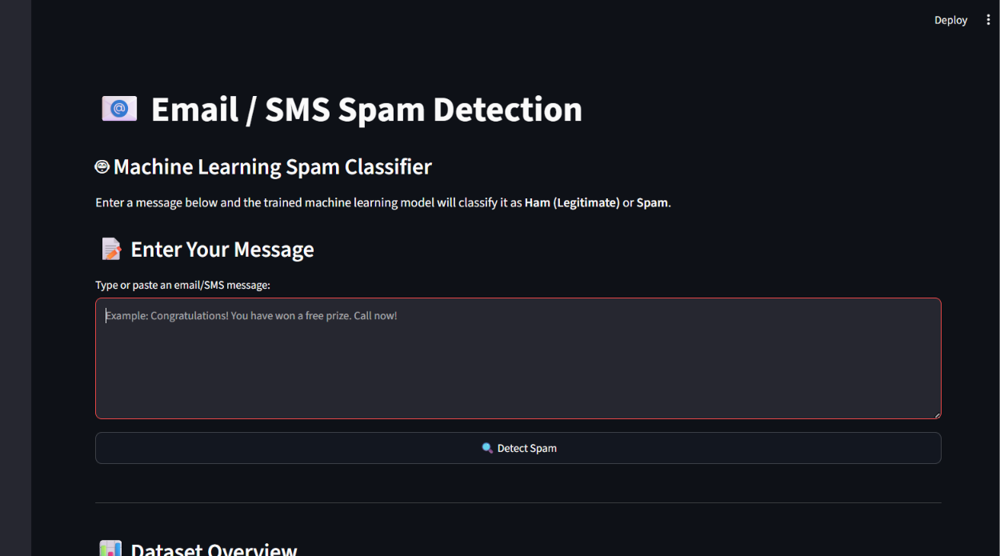
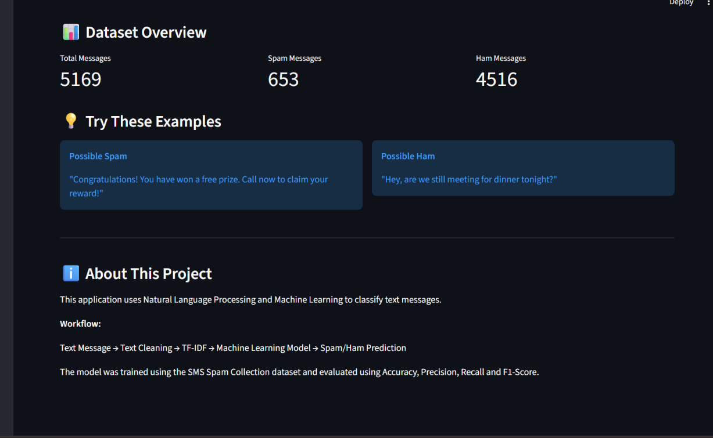
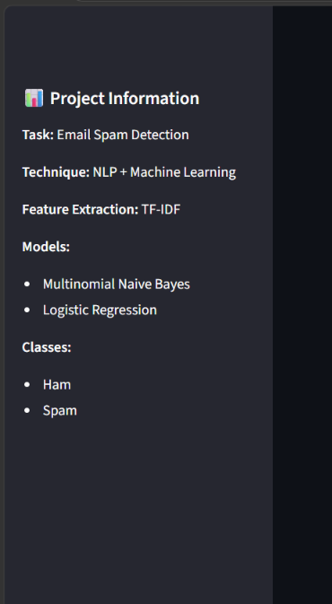

# 📧 Email / SMS Spam Detection using Machine Learning

## 📌 Project Overview

This project develops an **Email / SMS Spam Detection system** using **Natural Language Processing (NLP)** and **Machine Learning**.

The system analyzes a text message and classifies it into one of two categories:

- **Ham** — a legitimate/non-spam message
- **Spam** — an unwanted, promotional, or suspicious message

The project follows a complete machine-learning workflow, beginning with dataset exploration and text preprocessing and continuing through TF-IDF feature extraction, model training, evaluation, error analysis, model serialization, and deployment through an interactive Streamlit application.

The final application allows a user to enter an SMS or email-style message and receive a real-time **Spam/Ham prediction** along with prediction confidence when supported by the selected classifier.

---

## 🎯 Project Objectives

The major objectives of this project are:

1. Load and understand a labeled text-message dataset.
2. Inspect the dataset for missing values and duplicate records.
3. Analyze the distribution of Ham and Spam messages.
4. Clean and normalize raw text.
5. Convert categorical labels into numerical values.
6. Split the data into training and testing sets.
7. Convert text into numerical features using **TF-IDF**.
8. Train multiple machine-learning classification models.
9. Evaluate the models using:
   - Accuracy
   - Precision
   - Recall
   - F1-Score
10. Analyze model errors using confusion matrices.
11. Examine commonly occurring words in Ham and Spam messages.
12. Compare the trained classifiers.
13. Select the best model based on F1-Score.
14. Save the trained classifier and TF-IDF vectorizer using Joblib.
15. Build an interactive Streamlit dashboard for real-time prediction.
16. Prepare the project for reproducible execution and deployment.

---

# 📊 Dataset

## Dataset Used

The project uses the **SMS Spam Collection** dataset.

The original dataset is provided as a tab-separated text file named:

```text
SMSSpamCollection
```

Unlike a conventional `.csv` file, the original dataset does not use a `.csv` extension. Each line contains:

```text
label<TAB>message
```

For example:

```text
ham    Go until jurong point, crazy... Available...
ham    Ok lar... Joking wif u oni...
spam   Free entry in 2 a wkly comp...
```

The dataset contains two classes:

| Label | Meaning |
|---|---|
| `ham` | Legitimate/non-spam message |
| `spam` | Spam/unwanted message |

## Dataset Location

Inside the project:

```text
data/
├── SMSSpamCollection
└── readme
```

## Dataset Cleaning Result

The original dataset contains **5,574 records**. Duplicate records were removed before model training.

After duplicate removal, the dashboard reports:

- **Total messages:** 5,169
- **Spam messages:** 653
- **Ham messages:** 4,516

The class distribution therefore remains imbalanced, with legitimate Ham messages representing the majority of the cleaned dataset.

---

# 🧹 Data Preprocessing

Text data normally contains variations and characters that may not contribute directly to classification.

A preprocessing function was therefore created to standardize the messages before feature extraction.

## Preprocessing Steps

### 1. Convert text to lowercase

All messages are converted to lowercase so that words such as:

```text
FREE
Free
free
```

are treated consistently.

### 2. Remove URLs

Web addresses are removed because they can introduce noisy or highly variable tokens.

### 3. Remove email addresses

Email addresses are removed from the text during preprocessing.

### 4. Remove non-alphabetic characters

Numbers and special characters are removed so that the text representation focuses primarily on alphabetic words.

### 5. Remove extra whitespace

Multiple spaces are reduced to a single space and leading/trailing whitespace is removed.

## Example

Raw message:

```text
Congratulations! You have won a free prize. Call now!!!
```

After preprocessing, the message becomes approximately:

```text
congratulations you have won a free prize call now
```

---

# 🔢 Target Encoding

Machine-learning classifiers require numerical target values.

The original labels are converted using:

```text
Ham  → 0
Spam → 1
```

Therefore:

- `0` represents a legitimate message.
- `1` represents a spam message.

---

# 📈 Exploratory Data Analysis

Several exploratory analyses were performed before model training.

## Class Distribution

The number of Ham and Spam messages was visualized using a bar chart.

The cleaned dataset contains substantially more Ham messages than Spam messages.

This imbalance is important when interpreting model performance. Accuracy alone may not fully describe how well the classifier identifies the minority Spam class.

---

# 🔤 Natural Language Processing

## TF-IDF Feature Extraction

Machine-learning algorithms cannot directly process raw text.

The project therefore uses **Term Frequency-Inverse Document Frequency (TF-IDF)** to transform text messages into numerical feature vectors.

TF-IDF assigns importance to terms based on their occurrence within a message and across the collection of messages.

A word that occurs frequently in one message but is less common throughout the dataset can receive a relatively higher TF-IDF weight.

## TF-IDF Configuration

The vectorizer was configured with:

```text
stop_words="english"
ngram_range=(1, 2)
min_df=2
max_features=10000
```

### Stop Words

Common English stop words are removed to reduce unnecessary features.

### Unigrams and Bigrams

The vectorizer considers:

- **Unigrams** — individual words
- **Bigrams** — pairs of consecutive words

This allows the model to capture both individual terms and short phrases.

### Minimum Document Frequency

Terms appearing in fewer than two documents are excluded.

### Maximum Features

The vocabulary is limited to a maximum of 10,000 features.

## Preventing Data Leakage

The TF-IDF vectorizer is fitted only on the training data:

```text
Training text
     ↓
fit_transform()
```

The test data is transformed using the already-fitted vectorizer:

```text
Test text
     ↓
transform()
```

This prevents information from the test set from influencing the feature vocabulary during training.

---

# 🧪 Train-Test Split

The cleaned dataset was divided into:

- **80% Training Data**
- **20% Testing Data**

The training set is used to learn the relationship between message text and the target label.

The testing set is kept separate and is used to evaluate how well the trained models perform on unseen messages.

## Stratification

A stratified split was used so that the relative proportions of Ham and Spam messages are preserved across the training and testing sets.

## Reproducibility

The split uses:

```python
random_state=42
```

This allows the experiment to be reproduced with the same data and configuration.

---

# 🤖 Machine Learning Models

Two classification algorithms were trained and evaluated.

---

## 1. Multinomial Naive Bayes

**Multinomial Naive Bayes** is a popular algorithm for text classification.

It is particularly useful for problems involving word-frequency or text-derived features and can efficiently handle high-dimensional sparse feature matrices.

In this project, the model receives TF-IDF vectors as input and predicts whether each message belongs to the Ham or Spam class.

### Advantages

- Fast to train
- Efficient for text classification
- Works well with sparse feature matrices
- Simple and interpretable baseline for NLP classification

---

## 2. Logistic Regression

**Logistic Regression** is a supervised classification algorithm commonly used for binary classification.

It works effectively with high-dimensional sparse feature representations such as TF-IDF.

In this project, Logistic Regression is trained on exactly the same TF-IDF representation used by the Naive Bayes model, making the comparison more consistent.

### Advantages

- Strong baseline for binary classification
- Effective with sparse text features
- Provides probability estimates when supported by the model
- Often performs well on TF-IDF representations

---

# 📏 Model Evaluation

The classifiers are evaluated using four primary metrics.

## Accuracy

Accuracy measures the proportion of all predictions that are correct.

```text
Accuracy =
Correct Predictions / Total Predictions
```

A high accuracy indicates that the model correctly classifies a large proportion of messages overall.

However, because the dataset is imbalanced, accuracy should not be considered in isolation.

---

## Precision

Precision measures how many messages predicted as Spam are actually Spam.

```text
Precision =
True Positives / (True Positives + False Positives)
```

High precision means that the model produces relatively few false Spam alerts.

This is important because a legitimate message incorrectly classified as Spam is a **False Positive**.

---

## Recall

Recall measures how many of the actual Spam messages are successfully detected.

```text
Recall =
True Positives / (True Positives + False Negatives)
```

Recall is particularly important for this project.

A **False Negative** occurs when an actual Spam message is classified as Ham.

In a spam-filtering system, missed Spam messages are an important type of error, so a strong recall value is desirable.

---

## F1-Score

F1-Score combines Precision and Recall into a single metric.

```text
F1 =
2 × (Precision × Recall) /
(Precision + Recall)
```

F1-Score is useful when both false positives and false negatives matter.

For this project, F1-Score is used as the **primary criterion for selecting the final model**.

---

# 📊 Confusion Matrix

Confusion matrices were generated for both classifiers.

A binary confusion matrix contains four outcomes:

| Actual | Predicted | Meaning |
|---|---|---|
| Ham | Ham | True Negative |
| Ham | Spam | False Positive |
| Spam | Ham | False Negative |
| Spam | Spam | True Positive |

## Why False Negatives Matter

A False Negative means:

```text
Actual Spam → Predicted Ham
```

This means the spam detector failed to identify an unwanted message.

Because this is a spam-detection problem, reducing False Negatives and maintaining strong Spam recall are important considerations.

---

# 🔍 Error Analysis

After model prediction, misclassified test messages were extracted for further analysis.

The error-analysis table identifies:

- Original message
- Actual class
- Predicted class

The main error types are:

### False Positive

```text
Actual: Ham
Predicted: Spam
```

A legitimate message is incorrectly blocked or flagged.

### False Negative

```text
Actual: Spam
Predicted: Ham
```

An unwanted message passes through the classifier as if it were legitimate.

Examining these errors helps identify limitations of the model and provides direction for future improvements.

---

# 📝 Word Frequency Analysis

Word-frequency analysis was performed separately for Ham and Spam messages.

The cleaned messages were combined by class and tokenized into individual words.

The most common words were then identified using frequency counts.

This analysis provides additional insight into the language patterns found in the dataset.

Spam messages may contain terms related to:

- Promotions
- Prizes
- Offers
- Money
- Urgency
- Calls or contact instructions

Ham messages generally contain more conversational and personal communication.

The actual word frequencies are generated by the notebook from the dataset rather than being manually hard-coded.

---

# 📊 Model Comparison

The two trained classifiers are compared using:

| Model | Accuracy | Precision | Recall | F1-Score |
|---|---:|---:|---:|---:|
| Multinomial Naive Bayes | Generated in notebook | Generated in notebook | Generated in notebook | Generated in notebook |
| Logistic Regression | Generated in notebook | Generated in notebook | Generated in notebook | Generated in notebook |

The notebook automatically calculates these values using the held-out test set.

No performance values are manually hard-coded into this README so that the documentation remains consistent with the actual notebook execution.

---

# 🏆 Best Model Selection

The final model is selected automatically according to the highest **F1-Score**.

The notebook compares:

```text
Multinomial Naive Bayes F1-Score
vs.
Logistic Regression F1-Score
```

The classifier with the higher F1-Score becomes:

```text
best_model
```

This approach avoids choosing a model based solely on accuracy and gives balanced consideration to Precision and Recall.

---

# 💾 Model Serialization

After selecting the best-performing classifier, the trained model is saved using **Joblib**.

The TF-IDF vectorizer is also saved.

## Saved Files

```text
model/
├── spam_classifier.pkl
└── tfidf_vectorizer.pkl
```

### `spam_classifier.pkl`

Contains the trained final machine-learning classifier.

### `tfidf_vectorizer.pkl`

Contains the fitted TF-IDF transformation.

Both files are required by the Streamlit application.

Saving the vectorizer is important because new user messages must be transformed using the same feature representation used during training.

---

# 🧪 Saved Model Verification

The project reloads both serialized files and performs predictions on sample messages.

### Sample Spam Message

```text
Congratulations! You have won a free prize. Call now!
```

### Sample Ham Message

```text
Hey, are we still meeting for dinner tonight?
```

The saved classifier and vectorizer successfully perform inference after being reloaded, confirming that the serialized artifacts can be used outside the original training session.

---

# 🌐 Streamlit Application

A Streamlit dashboard was developed to provide a user-friendly interface for the trained model.

The application allows a user to enter or paste an SMS/email-style message and receive a prediction.

## Application Workflow

```text
User Message
     ↓
Text Cleaning
     ↓
TF-IDF Transformation
     ↓
Saved Machine Learning Model
     ↓
Spam / Ham Prediction
     ↓
Prediction Confidence
```

---

# 🖥️ Dashboard Features

The Streamlit application includes:

### 📝 Message Input

Users can type or paste an email/SMS message into a text area.

### 🔍 Spam Detection

The application processes the message and predicts whether it is:

```text
SPAM
```

or:

```text
HAM — LEGITIMATE MESSAGE
```

### 📊 Prediction Confidence

When the selected classifier supports probability estimation, the application displays the confidence associated with the prediction.

### 📈 Dataset Overview

The dashboard displays:

- Total Messages
- Spam Messages
- Ham Messages

### 💡 Example Messages

The dashboard provides example Spam and Ham messages so that users can quickly test the application.

### ℹ️ Project Information

The sidebar describes:

- Task
- NLP technique
- TF-IDF
- Models
- Classes

---

# 📸 Application Screenshots

## 1. Spam Prediction

The main dashboard allows the user to enter a message and receive a real-time Spam/Ham prediction.



---

## 2. Dataset Overview

The dashboard displays the cleaned dataset statistics, including total messages and the number of Spam and Ham messages.



---

## 3. Project Information

The sidebar presents the project's NLP technique, TF-IDF feature extraction method, machine-learning models, and classification classes.



---

# 📁 Project Structure

```text
DataScience-Task4-EmailSpamDetection/
│
├── data/
│   ├── SMSSpamCollection
│   └── readme
│
├── model/
│   ├── spam_classifier.pkl
│   └── tfidf_vectorizer.pkl
│
├── screenshots/
│   ├── 01_spam_prediction.png
│   ├── 02_dataset_overview.png
│   └── 03_project_information.png
│
├── Email_Spam_Detection.ipynb
├── app.py
├── README.md
└── requirements.txt
```

---

# 🛠️ Technology Stack

## Programming Language

- Python

## Data Processing

- Pandas
- NumPy

## Data Visualization

- Matplotlib
- Seaborn

## Machine Learning

- Scikit-learn

## Natural Language Processing

- TF-IDF Vectorization
- Regular-expression-based text preprocessing

## Model Persistence

- Joblib

## Application Development

- Streamlit

## Development Environment

- Jupyter Notebook
- Visual Studio Code

---

# 📦 Requirements

The project uses the following Python packages:

```text
pandas
numpy
scikit-learn
streamlit
joblib
matplotlib
seaborn
```

A `requirements.txt` file is included in the project for dependency installation.

---

# ⚙️ Installation

## 1. Clone the Repository

```bash
git clone https://github.com/atharva123-buddy/OIBSIP.git
```

## 2. Navigate to the Project

```bash
cd OIBSIP/DataScience-Task4-EmailSpamDetection
```

## 3. Install Dependencies

```bash
pip install -r requirements.txt
```

---

# ▶️ Running the Notebook

From the project directory, launch Jupyter Notebook:

```bash
jupyter notebook
```

Open:

```text
Email_Spam_Detection.ipynb
```

Run the notebook cells sequentially.

The notebook performs:

```text
Data Loading
      ↓
Data Inspection
      ↓
Duplicate Removal
      ↓
EDA
      ↓
Text Cleaning
      ↓
Train-Test Split
      ↓
TF-IDF
      ↓
Model Training
      ↓
Evaluation
      ↓
Error Analysis
      ↓
Model Selection
      ↓
Model Serialization
```

---

# 🚀 Running the Streamlit Dashboard

From the **OIBSIP root directory**, run:

```bash
streamlit run DataScience-Task4-EmailSpamDetection/app.py
```

Alternatively, from inside the Task 4 folder:

```bash
streamlit run app.py
```

The Streamlit application will start locally and provide a browser URL.

---

# 🧪 Example Usage

## Example 1 — Spam

Enter:

```text
Congratulations! You have won a free prize. Call now to claim your reward!
```

The application should classify the message according to the trained model, with a typical expected result of:

```text
SPAM
```

---

## Example 2 — Ham

Enter:

```text
Hey, are we still meeting for dinner tonight?
```

The application should classify the message according to the trained model, with a typical expected result of:

```text
HAM
```

These examples are provided for demonstration purposes; predictions are produced by the trained classifier.

---

# 🔐 Reproducibility

The project uses fixed configuration choices to make the experiment reproducible.

Important settings include:

```text
Train/Test Split: 80/20
Random State: 42
TF-IDF ngram range: (1, 2)
TF-IDF minimum document frequency: 2
Maximum TF-IDF features: 10,000
```

The vectorizer is fitted only on training data, and the same fitted vectorizer is reused during testing and application inference.

---

# ⚠️ Limitations

Although the classifier performs well for the provided dataset, several limitations remain.

### Dataset Domain

The training data consists primarily of SMS-style messages, so performance may differ on modern, long-form emails.

### Dataset Age

Language patterns, spam strategies, and communication platforms change over time.

### Text Cleaning

Removing numbers and special characters can sometimes discard information that could be useful for identifying Spam.

### Dataset Imbalance

The dataset contains considerably more Ham messages than Spam messages.

### Generalization

A model trained on this dataset may not generalize perfectly to unseen spam campaigns, languages, or message formats.

---

# 🔮 Future Improvements

Potential improvements include:

- Stemming and lemmatization
- More advanced text normalization
- Hyperparameter tuning
- Cross-validation
- Testing additional classifiers
- Handling class imbalance explicitly
- Using word embeddings
- Using modern transformer-based NLP models
- Adding multilingual spam detection
- Adding batch message classification
- Adding probability thresholds
- Adding explainable prediction features
- Expanding the training dataset
- Monitoring model performance after deployment
- Building a production-grade API

---

# 🎓 Learning Outcomes

This project provided practical experience with:

- Natural Language Processing
- Text preprocessing
- Exploratory Data Analysis
- TF-IDF feature engineering
- Train-test splitting
- Binary classification
- Multinomial Naive Bayes
- Logistic Regression
- Accuracy evaluation
- Precision evaluation
- Recall evaluation
- F1-Score evaluation
- Confusion matrix analysis
- Error analysis
- Word-frequency analysis
- Model comparison
- Model serialization
- Streamlit development
- Machine-learning deployment preparation

---

# 💼 Project Highlights

This project demonstrates an end-to-end machine-learning workflow rather than only model training.

### Data Science

- Dataset inspection
- Cleaning
- EDA
- Feature engineering

### NLP

- Text normalization
- TF-IDF
- N-gram features

### Machine Learning

- Multiple classifiers
- Performance comparison
- Model selection

### Evaluation

- Accuracy
- Precision
- Recall
- F1-Score
- Confusion matrices
- Error analysis

### Deployment

- Serialized model
- Serialized TF-IDF vectorizer
- Streamlit dashboard
- Real-time inference

---

# 👨‍💻 Author

**Atharva Joshi**

Data Science Internship Project  
**Oasis Infobyte**

---

# 🏢 Internship

This project was developed as part of the **Oasis Infobyte Data Science Internship**.

**Task:** Email Spam Detection

**Domain:** Data Science / Machine Learning / NLP

---

# ⚠️ Disclaimer

This project is intended for educational and internship purposes.

The predictions generated by the model should not be considered a guaranteed spam-filtering solution for security-critical or production environments. Real-world deployment would require continuous monitoring, validation on current data, security review, and additional safeguards.

---

# ⭐ Project Status

```text
✅ Dataset prepared
✅ Data cleaning completed
✅ Exploratory analysis completed
✅ NLP preprocessing completed
✅ TF-IDF feature extraction completed
✅ Multinomial Naive Bayes trained
✅ Logistic Regression trained
✅ Model evaluation completed
✅ Confusion matrices generated
✅ Error analysis completed
✅ Word-frequency analysis completed
✅ Best model selected
✅ Model serialized
✅ TF-IDF vectorizer serialized
✅ Streamlit dashboard developed
✅ Dashboard tested
```

