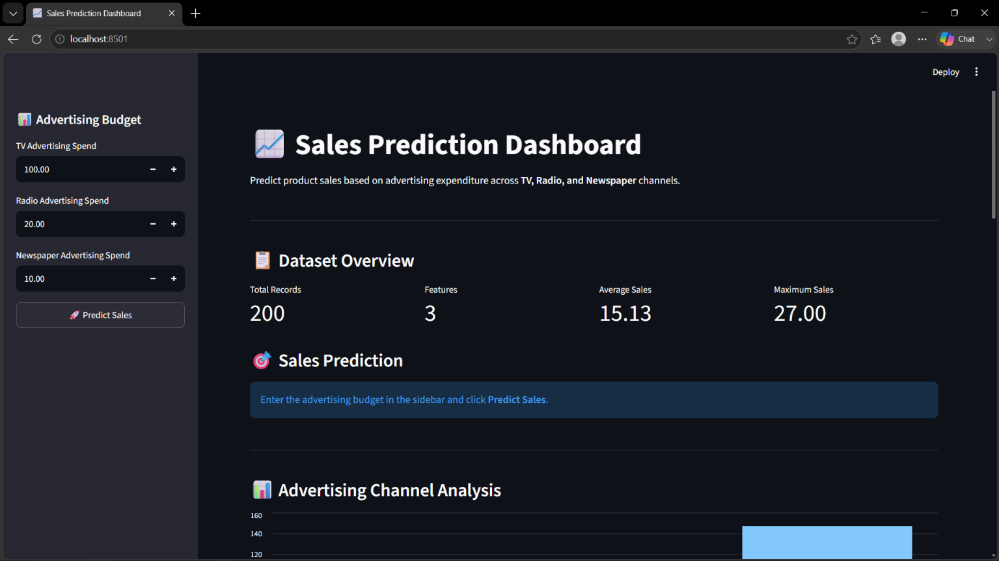
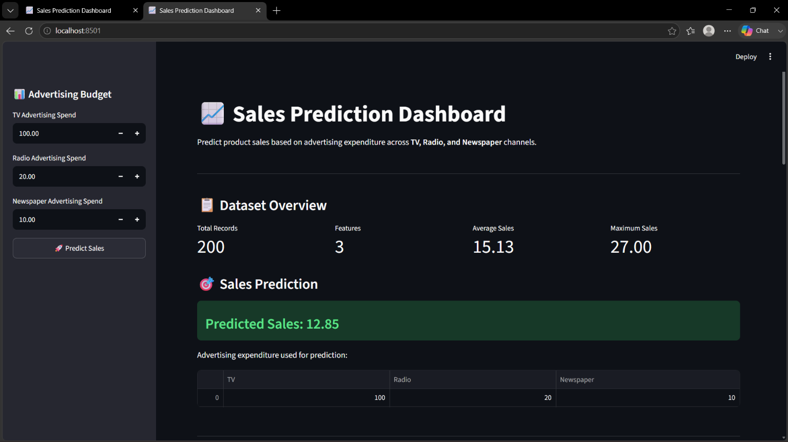
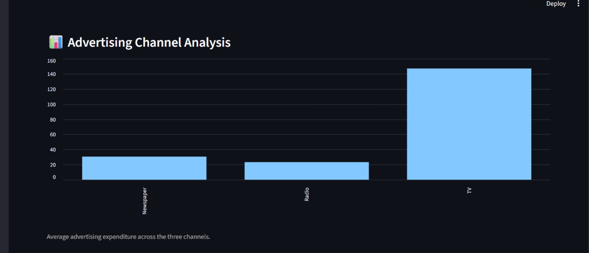
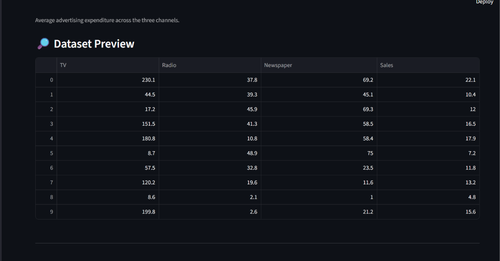

# 📈 Sales Prediction Using Advertising Expenditure

## OASIS INFOBYTE — Data Science Internship

**Task:** Task 5 — Sales Prediction  
**Project:** Sales Prediction Using Machine Learning  
**Author:** Atharva Joshi  
**Track:** Data Science  
**Repository:** OIBSIP

---

## 🚀 Live Demo

[](https://oibsip-cod3adjuqdptywfuappnkbq.streamlit.app/)

---

## 📌 Project Overview

This project is part of the OASIS INFOBYTE Data Science Internship and focuses on predicting product sales using advertising expenditure.

The dataset contains expenditure across three advertising channels: TV, Radio, and Newspaper. The objective is to build regression models that learn the relationship between advertising expenditure and sales, compare their performance, identify the most influential advertising channel, save the trained model, and provide an interactive Streamlit dashboard for predictions.

## 🎯 Objectives

- Load and inspect the advertising dataset.
- Perform data cleaning and exploratory data analysis.
- Analyze relationships between advertising channels and sales.
- Create correlation and distribution visualizations.
- Train Linear Regression as a baseline model.
- Train Random Forest Regression as an additional model.
- Evaluate models using MAE, RMSE, and R².
- Select the best-performing model.
- Analyze actual vs predicted values and residuals.
- Identify the most influential advertising channel.
- Save and reload the trained model using Joblib.
- Provide an interactive Streamlit prediction dashboard.

---

## 📊 Dataset

**Source:** Kaggle Advertising Dataset  
https://www.kaggle.com/datasets/ashydv/advertising-dataset

The dataset contains **200 records** and four columns:

| Column | Description | Role |
|---|---|---|
| `TV` | Advertising expenditure through TV | Feature |
| `Radio` | Advertising expenditure through Radio | Feature |
| `Newspaper` | Advertising expenditure through Newspaper | Feature |
| `Sales` | Product sales | Target |

The model uses:

```text
TV + Radio + Newspaper → Sales
```

---

## 🔎 Exploratory Data Analysis

The notebook performs:

1. Dataset shape, columns, data types and descriptive statistics.
2. Missing-value inspection.
3. Duplicate-record inspection and removal.
4. Histograms for numerical variables.
5. Scatter plots of Sales against TV, Radio and Newspaper.
6. Correlation matrix.
7. Correlation heatmap.

These steps provide an understanding of the dataset and the relationships between advertising expenditure and sales before model training.

---

## 🤖 Machine Learning

### Linear Regression

Linear Regression is used as the baseline model to estimate a linear relationship between the three advertising channels and Sales.

### Random Forest Regression

Random Forest Regression is used as the second model. It combines multiple decision trees and can capture non-linear relationships.

Configuration used:

```python
RandomForestRegressor(
    n_estimators=300,
    random_state=42,
    n_jobs=-1
)
```

---

## 📏 Model Evaluation

Both models are evaluated on an 80/20 train-test split using:

### MAE — Mean Absolute Error
Measures the average absolute prediction error. Lower is better.

### RMSE — Root Mean Squared Error
Measures prediction error while giving larger errors greater weight. Lower is better.

### R² Score
Measures the proportion of variation in Sales explained by the model. Higher is better.

The model comparison considers all three metrics, with the highest R² used to select the best-performing model in the notebook.

---

## 📈 Prediction and Error Analysis

The selected model is evaluated using:

- Actual vs Predicted Sales plot
- Residual plot
- Mean residual
- Final MAE, RMSE and R²

Residuals are calculated as:

```text
Residual = Actual Sales − Predicted Sales
```

A good regression model should generally have residuals distributed around zero without a strong systematic pattern.

---

## 📊 Advertising Channel Impact

Feature impact is analyzed for:

```text
TV
Radio
Newspaper
```

For Random Forest, `feature_importances_` is used. For Linear Regression, absolute coefficients are used.

The channel with the highest value is reported as the most influential feature for the selected model.

---

## 💾 Model Persistence

The selected model is saved with Joblib as:

```text
model/sales_prediction_model.pkl
```

The notebook then reloads the saved model and tests it on a sample advertising budget:

```text
TV = 100
Radio = 20
Newspaper = 10
```

---

## 🌐 Streamlit Dashboard

The project includes an interactive Streamlit application.

### Features

- 📊 Dataset overview
- 🎯 Sales prediction
- 📺 TV advertising input
- 📻 Radio advertising input
- 📰 Newspaper advertising input
- 📈 Advertising channel analysis
- 🔎 Dataset preview
- ℹ️ Project information

Users can enter an advertising budget and click **Predict Sales** to obtain a predicted sales value.

---

## 📁 Project Structure

```text
DataScience-Task5-SalesPrediction/
│
├── data/
│   └── advertising.csv
│
├── model/
│   └── sales_prediction_model.pkl
│
├── screenshots/
│   ├── 01_dashboard_overview.png
│   ├── 02_sales_prediction.png
│   ├── 03_advertising_channel_analysis.png
│   └── 04_project_information.png
│
├── Sales_Prediction.ipynb
├── app.py
├── README.md
└── requirements.txt
```

---

## 🖼️ Screenshots

### Dashboard Overview



### Sales Prediction



### Advertising Channel Analysis



### Project Information



---

## 🚀 Run the Project Locally

### 1. Clone the repository

```bash
git clone https://github.com/atharva123-buddy/OIBSIP.git
cd OIBSIP
```

### 2. Create and activate a virtual environment

Windows PowerShell:

```powershell
python -m venv venv
.env\Scripts\Activate.ps1
```

### 3. Install dependencies

```powershell
pip install -r DataScience-Task5-SalesPrediction/requirements.txt
```

### 4. Open Task 5

```powershell
cd DataScience-Task5-SalesPrediction
```

### 5. Run Streamlit

```powershell
streamlit run app.py
```

The dashboard will open in the browser.

---

## 📓 Notebook Workflow

`Sales_Prediction.ipynb` contains the complete workflow:

1. Project overview
2. Dataset description
3. Imports
4. Dataset loading
5. Initial exploration
6. Data cleaning
7. EDA
8. Distribution analysis
9. Advertising vs Sales analysis
10. Correlation analysis
11. Feature and target preparation
12. Train-test split
13. Linear Regression
14. Random Forest Regression
15. Model comparison
16. Best model selection
17. Actual vs predicted analysis
18. Residual analysis
19. Feature impact analysis
20. Final evaluation
21. Model saving
22. Saved-model testing
23. Conclusion and future improvements

---

## 🛠️ Technologies Used

- Python
- Pandas
- NumPy
- Matplotlib
- Seaborn
- Scikit-learn
- Joblib
- Jupyter Notebook
- Streamlit

---

## 📦 Requirements

The `requirements.txt` file contains:

```text
pandas
numpy
scikit-learn
matplotlib
seaborn
joblib
streamlit
```

---

## 🔮 Future Improvements

1. Hyperparameter tuning with GridSearchCV or RandomizedSearchCV.
2. Testing additional regression algorithms.
3. Using cross-validation.
4. Exploring polynomial relationships.
5. Adding more historical advertising and sales data.
6. Adding more interactive model-performance visualizations.
7. Deploying the dashboard through Streamlit Community Cloud.

---

## ✅ Project Outcome

This project demonstrates an end-to-end machine learning workflow:

**Data → Cleaning → EDA → Feature Analysis → Model Training → Evaluation → Model Selection → Interpretation → Model Saving → Interactive Prediction**

The final system predicts product sales from TV, Radio and Newspaper advertising expenditure and provides an interactive dashboard for practical use.

---

## 👨‍💻 Author

**Atharva Joshi**  
Data Science Intern  
OASIS INFOBYTE

---

## 📌 Internship Project

Developed as part of the **OASIS INFOBYTE Data Science Internship — Task 5: Sales Prediction**.

**Repository:** `OIBSIP`  
**Task Folder:** `DataScience-Task5-SalesPrediction`
